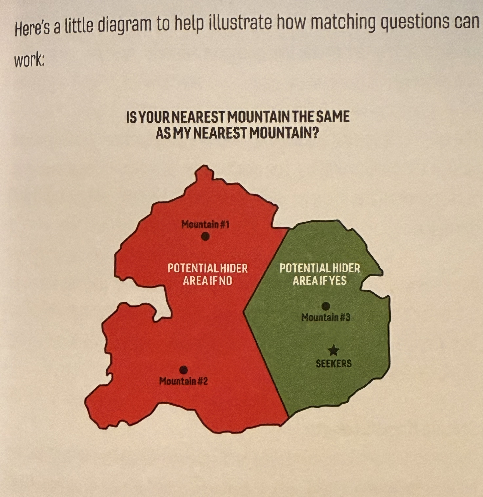
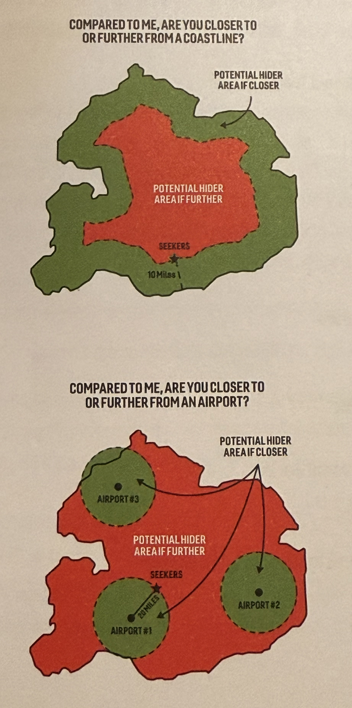
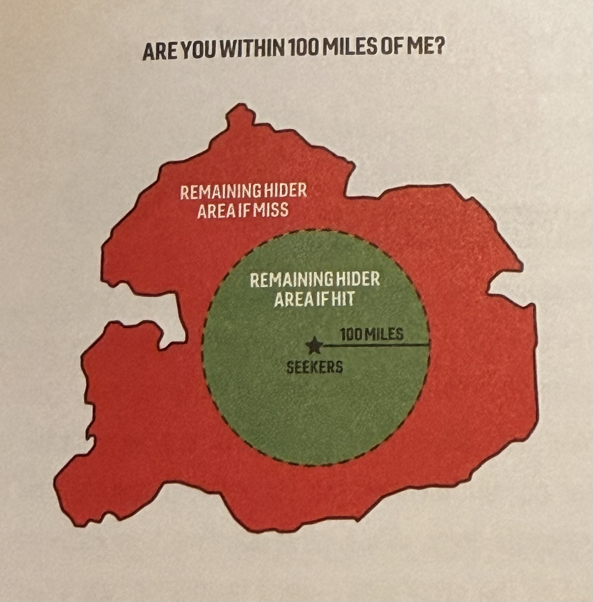
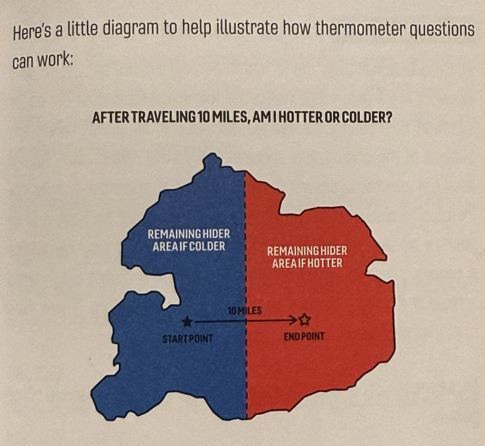
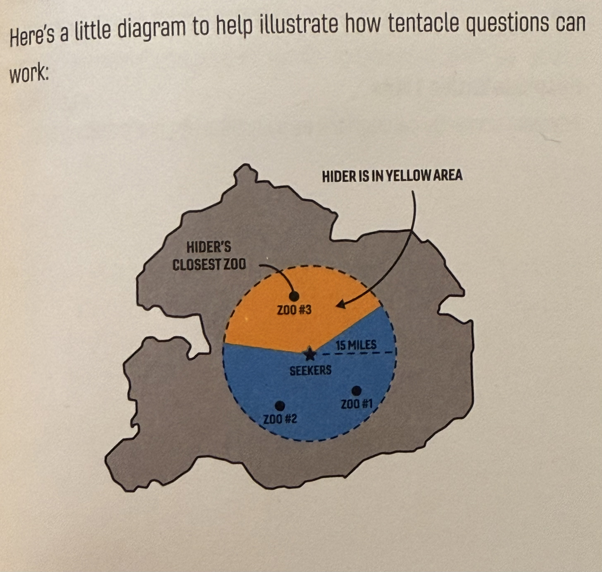

# Jet Lag: Hide + Seek Rules  

# OVERVIEW  
1. One player uses **public transit** to get to a **hiding spot**.  
2. The other players work together to find them by **asking questions** about their location, chosen from **six question categories**.  
3. Each time the hider answers a question, they draw cards from the **hider deck**. These cards give them advantages in the game.   
4. Once the hider is found by the seekers, another player hides.  
5. At the end, **whoever hid the longest wins.**  

## **The Map**  
Transit Station: MAX, Streetcar, Bus stop  
  
[Tri-Met System](https://trimet.org/maps/img/trimetsystem.png?v=aug24)  
[Bus Lines](https://trimet.org/bus/)  
[Portland City Center](https://trimet.org/maps/img/citycenter.png?v=aug24)  
[Rail System](https://trimet.org/maps/img/railsystem.png?v=aug24)  
[Frequent Service](https://trimet.org/maps/img/frequentservice.png?v=aug24)  
  
## **Round Start**  
At the start of each round, one player/team will become the hider, while the remaining players will band together to play as that round’s seekers. The order in which each player hides should be determined at random when the game begins.   
  
While all players are at the starting location—which can be anywhere in the game map—there are a few items to be distributed. The hider receives the **hider deck**, and the seekers need some method to record answers and mark down a map of the play area. Both sides also need to keep at least **two dice** on them at all times, as these are used for various different things during the game.   
  
Each round begins with a **1 hour hiding period**. During this time, the hider can use their legs and public transit to travel to any transit station within the map’s boundaries. Once the hiding period has concluded, the hider must stay within their **1/4 mile hiding zone** for the rest of the round.   
  
Lastly, all seekers should make sure to turn on some form of tracker during this period to ensure that the hider can follow their movements through the round (such as “Find My on iOS, or Google Maps sharing on Android).  

## Hiding Zones  
At the end of the hiding period, the hider must be at a transition station that is included in the game’s map. This now acts as the center of their hiding zone. The hiding zone extends 1/4 mile from the transit station in all directions, forming a circle within which the hider may move freely until the **end game** begins.   
  
  
## Asking Questions  
In order to gather information about the hider’s location, the seekers will have to ask questions. These questions can be asked at any time, as long as the previous question has been answered, and must be answered truthfully by the hider within 5 mins (or 10 minutes for photo questions). We ask hiders to make a good faith effort to answer all questions in the allotted time, however if questions are not answered in the allotted time window, the hider’s time is paused until the question is answered, and the hider will receive no cards in exchange for answering.   
  
After a question has been answered, the hider may draw and keep a certain number of cards from the **hider deck**, depending on the category of question asked.   
  
Once a question has been asked, it cannot be asked again unless seekers choose to **pay its cost twice**. So, for example, a question that would typically allow a hider to draw 3 cards and keep 1 would now allow a hider to draw 3, keep 1 then draw 3, and keep 1 again. (Importantly hiders cannot draw 6 and keep 2, they must do the complete action twice). Should seekers want to ask a question a third time, its cost would be triple; a fourth time quadrupled, and so on.   
  
As you gather information about the hider’s location, you can use the internet for research to develop your theories. The only prohibited source of information is a “street view” tool such as Google Street View or Apple Maps Look Around, everything else is game.   
  
  
## The Hider Deck  
The hider deck contains three types of cards the hider can use to their advantage: **time bonus cards, power cards, **and** curse cards**. Cards are drawn after a question is answered, and kept in the hider’s hand until they are played or discarded into the discard pile. **The hider can keep a maximum of 6 cards in their hand at a time **(unless their hand size has been expanded by playing a power card). If at any point the hider has exceeded their hand limit, they must immediately play or discard cards until they only have 6 cards remaining.   
  
  
## The End Game  
Once the seekers have entered the hider’s hiding zone—and are no longer on a mode of transit—the **end game** will begin. At this point, the hider may no longer move freely; they must stay put in a publicly accessible **hiding spot** until they are found. During the end game, some questions may be impossible to answer due to restrictions on the hiders movement. (For example a photo question that would require the hider to take a photo from their transit station. If they are not at the station, it would be impossible for them to move to it to take the picture.) In these cases, “I cannot answer the question” is considered a valid answer, and the hider would still pull a card. All questions other than photo questions should be possible to answer during the end game.   
  
  
## Rotating Rounds  
The hider is considered found once the seekers are **within 5 feet of them and have spotted them**. If the seekers are near the hider but haven’t identified them, then the hider hasn’t been caught. Once caught, the hider’s clock is stopped, and all time bonus cards currently in the hider’s hand are added to their time total.   
  
After the hider is caught, the new hider is permitted up to 10 minutes for any final planning before their hiding period begins. During this time, the new seekers should reshuffle all cards back into the hiding deck, hand it to the new hider, and ensure that the new hider’s tracker is turned off. They will begin the next round from the last hider’s hiding spot.   
  
After each player has completed their predetermined number of hiding rounds, **the player with the longest single hiding run is declared the winner. **  
  
  
  
# SEEKING  
As the seeker, it is your job to move and gather information as efficiently at possible. At your disposal are questions, which you can ask the hider at any time. The hider must answer all of your questions truthfully, but in exchange for answers, they’ll be rewarded with cards from their hider deck. Choosing the right questions at the right time is the key to a quick round—ask too many and you’ll be bogged down with curses or blown out with hours of time bonuses.   
  
To make sorting through these questions easier, they are divided into seven simple categories. All of the questions in the same category cost the same number of cards, and share the same sentence structure—it’s simply a matter of choosing a noun or value. Some categories are more useful during different stages of your search, so be sure to keep an open mind and change up your strategy s you close in on the hider.  
  
You cannot ask multiple questions at once; if you are eating on an answer from a previous question, you cannot ask your next question until the first has been answered.   
  
You can use the internet for research, but **you cannot use a Street View service** (like Google Street View) for it is too powerful when it comes to matching photos, and generally makes the game less fun.  
  
As you collect information, you should record it and mark on your game map. There are may types of information you can collect in a given round—photos, directions, and context clues—and you’ll want to stay on top of everything if you want any chance at finding your hider.   
  
## Mapping Apps  
Easily playing this game is going to require using a maps app on your smartphone or other device. For our game, we will be using Google Maps and a custom built map of interest points for the Portland Area. To understand many of the questions, it will be necessary to measure distances. In the Google Maps app, hold down anywhere that is not a formally listed location. A pin will pop up and if you scroll down you can select “measure distance,” then drag to measure from that point.   
  
Other apps or online services are welcome to be used, such as Apple Maps which often has better rail visualization or more accurate time tables, and can be useful for other aspects of the game, but for all question answer determination, Google Maps is our official platform.   
  
You will notice that many questions reference various categories of business or location. These are a specific type of pin in Google Maps to differentiate them. To simplify and prevent ambiguity, locations needed for most categories have been added to a custom shared Google Map. The question list will specify the source of data, be that a list, a linked website, or the Maps. For questions without a specified list of options (such as parks and schools) you should be able to find locations which match this entry by searching the category in Google Maps. Anywhere with 5 or more Google Reviews is assumed to be legitimate, unless all players can agree otherwise.  
  
In general, **it is the responsibility of the seekers to clarify any ambiguity in what they are asking**—for example, by sending a screenshot of everything they understand to qualify as a school when asking if the hider is near one.   
  
  
# QUESTIONS  
# MATCHING QUESTIONS  
Matching questions follow the format, “ is your nearest ______ the same as my _______?” valid answers are **yes** or **no**. Hiders have five minutes to answer. These questions can be useful at any point in the game, though they often require the seekers to move in order to optimize their efficacy.** It is important to note that if locations are not within the shared google map list of locations, players must operate as though they do not exist. **For example, if the seekers asked if they shared the same nearest commercial airport as the hider, but the only commercial airports were outside the map’s boundaries, it would return a null answer (no answers, count as answered questions, and hiders get to draw cards.)  
  
After a matching question has been answered, the hider may** draw 3, and keep 1.**  
  
  
## TRANSIT  
### Commercial Airport  
For our game, the three commercial airports are:  
	Portland International (PDX)  
	Hillsboro Airport  
	Troutdale Airport (KTTD)  
  
### Transit Line  
*Important: In order to ask this question, seekers must be on the form of transit, and it must be moving.*  
  
The answer is yes if the transit the seekers are currently riding would stop at the hider’s station. For clarity, best practice is to send your transit line and direction or upcoming stop IDs to the hider.  
  
A transit line is considered to stop at the station if they have the same Tri-Met Stop ID. In places such as a Transit Center, or MAX stop and a neighboring Bus stop, there can be different stop IDs for different lines or modes of transit, the hider should only respond “yes” if the seekers’ line has an arrival time on their stop ID.   
  
  
### Stop ID  
The Tri-Met stop ID of your nearest legal hiding station. This may not be your hiding station, as many hiding zones may include other stops. Bus stops which are not in play, such as non-frequent service lines, must be ignored.  
  
  
### Street or Path  
A street or path is considered to have ended when is squires a different name. This includes changing from, say, “Jet Lag St. East” to “Jet Lag St. West”  
  
If the street or path is unnamed, it is considered to start or end whenever it has an intersection.  
  
  
## ADMINISTRATIVE DIVISIONS  
### County  
Reference the [Oregon Metro Jurisdictional Boundary Map](https://www.oregonmetro.gov/sites/default/files/2024/11/22/Jurisdictional-boundaries-and-parks-44x34-20241119.pdf). Counties are separated by a dotted red line. The three possible counties are:  
	Washington  
	Multnomah  
	Clackamas  
  
### City  
Reference the [Oregon Metro Jurisdictional Boundary Map](https://www.oregonmetro.gov/sites/default/files/2024/11/22/Jurisdictional-boundaries-and-parks-44x34-20241119.pdf). Cities are indicated by the colored region. Anything with a white background is Unincorporated, which is considered a city division for the purposes of this question. Note some mapping apps may incorrectly report the city, especially around unincorporated areas, so please reference the map to confirm your current city division.   
  
### Postal Code  
Reference the [Oregon Metro ZIP Code Boundary Map](https://www.oregonmetro.gov/sites/default/files/2025/05/05/Greater-Portland-ZIP-code-boundaries-44x34-20250505.pdf) using the blue ZIP code boundaries. There are small administrative zip code regions listed on this map in red and green, these are ignored for the purposes of our game. Note some mapping apps may incorrectly report the ZIP code, so please reference the map to confirm your current zip code.   
  
### Neighborhood  
For the City of Portland only, reference [PortlandMaps](https://gis-pdx.opendata.arcgis.com/datasets/PDX::neighborhoods-regions/explore?location=45.528902%2C-122.510571%2C11.77) to confirm your neighborhood. If the hider is not within the City of Portland, or a labeled neighborhood, they should respond “no” not “null”.   
  
## NATURAL  
### Mountain  
Anything labeled as a mountain on the [Shared Google Map](https://www.google.com/maps/d/viewer?mid=18i7b-Mexy8nZjQucreEttLtbNp4DnyM&usp=sharing). Measure from the location of the pin.   
  
  
### Landmass  
An area of land that is in one piece, not broken up by a waterway. If the hider is on a landmass that is entirely surrounded by the landmass the seekers are on, it counts as a match.   
  
The main dividers of this in our map is the Willamette river, however there are some islands (Sauvie Island, Hayden Island) which do not share landmass with east or west metro.   
  
  
### Park  
Anything correctly classified as a park on Google Maps. Measure distance from the map icon.   
  
There is a possibility that measuring to the map icon can lead to strange outcomes—for example, if you are in a very large park but far from the center, you may be several miles from that park’s map icon. You might be closer to the icon of a smaller, nearby park. This could mean that you are forced to say that your nearest park is the small one, even though you are literally in the bigger park. Nonetheless, measuring to the map icon is the best, most objective way to handle these questions, even when it produces these edge case outcomes.  
  
  
## PLACES OF INTEREST  
### Amusement Park  
Anything labeled as an Amusement Park on the [Shared Google Map](https://www.google.com/maps/d/viewer?mid=18i7b-Mexy8nZjQucreEttLtbNp4DnyM&usp=sharing). Measure from the location of the pin.   
  
### Zoo  
Anything labeled as a Zoo on the [Shared Google Map](https://www.google.com/maps/d/viewer?mid=18i7b-Mexy8nZjQucreEttLtbNp4DnyM&usp=sharing). Measure from the location of the pin.   
  
### Stadium  
Anything labeled as a Stadium on the [Shared Google Map](https://www.google.com/maps/d/viewer?mid=18i7b-Mexy8nZjQucreEttLtbNp4DnyM&usp=sharing). Measure from the location of the pin.   
  
### Golf Course  
Anything labeled as a Golf Course on the [Shared Google Map](https://www.google.com/maps/d/viewer?mid=18i7b-Mexy8nZjQucreEttLtbNp4DnyM&usp=sharing). Measure from the location of the pin.   
  
### Museum  
Anything labeled as a Museum on the [Shared Google Map](https://www.google.com/maps/d/viewer?mid=18i7b-Mexy8nZjQucreEttLtbNp4DnyM&usp=sharing). Measure from the location of the pin.   
  
### Movie Theatre  
Anything labeled as a Movie Theatre on the [Shared Google Map](https://www.google.com/maps/d/viewer?mid=18i7b-Mexy8nZjQucreEttLtbNp4DnyM&usp=sharing). Measure from the location of the pin.   
  
  
## PUBLIC UTILITIES  
### Hospital  
Anything labeled as a Hospital on the [Shared Google Map](https://www.google.com/maps/d/viewer?mid=18i7b-Mexy8nZjQucreEttLtbNp4DnyM&usp=sharing). Measure from the location of the pin.   
  
### Library  
Anything labeled as a Library on the [Shared Google Map](https://www.google.com/maps/d/viewer?mid=18i7b-Mexy8nZjQucreEttLtbNp4DnyM&usp=sharing). Measure from the location of the pin.   
  
### Foreign Consulate  
Anything labeled as a Foreign Consulate on the [Shared Google Map](https://www.google.com/maps/d/viewer?mid=18i7b-Mexy8nZjQucreEttLtbNp4DnyM&usp=sharing). Measure from the location of the pin.   
  
  
# MEASURING QUESTIONS  
Measuring questions follow the format, “compared to me, are you closer to or further from ________?” Valid answers are **closer** or **further**. Hiders have five minutes to answer. These questions are also universally useful, and good for slicing the map in unique and clever ways. **It is important to note that if locations are not within a map’s boundaries, players must operate as if they do not exist. **For example, if the seekers asked if they shared the same nearest commercial airport as the hider, but the only commercial airports were outside the map’s boundaries, it would return a null answer (no answers, count as answered questions, and hiders get to draw cards.)  
  
  
  
## TRANSIT  
### Commercial Airport  
For our game, the three commercial airports are:  
	Portland International (PDX)  
	Hillsboro Airport  
	Troutdale Airport (KTTD)  
  
### MAX Line  
The Blue, Red, Green, Orange, or Yellow Max lines. Enable the transit layer in Google Maps and measure your distance to the nearest track NOT the nearest station.  
  
### MAX Station  
The Blue, Red, Green, Orange, or Yellow Max lines. Enable the transit layer in Google Maps and measure your distance to the nearest station.  
  
### Stop ID 0  
References the hider’s stop ID. If it is lower than the seekers, they would answer **closer**, if it’s higher they would answer **further**. Note that stop IDs are often different between the different directions of lines (such as bus stops across the street).   
  
Transit Lines  
References the hider’s transit stop. How many different lines (Bus, MAX, Streetcar) stop at your stop.   
  
## BOARDERS  
### State  
Boarder with Washington state. Will appear as a grey dotted line in the Columbia river.   
  
### County  
Reference the [Oregon Metro Jurisdictional Boundary Map](https://www.oregonmetro.gov/sites/default/files/2024/11/22/Jurisdictional-boundaries-and-parks-44x34-20241119.pdf). Counties are separated by a dotted red line. Measure to your closest line.  
  
### City  
Reference the [Oregon Metro Jurisdictional Boundary Map](https://www.oregonmetro.gov/sites/default/files/2024/11/22/Jurisdictional-boundaries-and-parks-44x34-20241119.pdf). Cities are indicated by the colored region. Measure to your nearest city boarder.  
  
  
## NATURAL  
### Sea Level  
This refers to your altitude. You can find this using your phone’s compass. Fair warning, sometimes the compass is wrong, so don’t rely too heavily on this being 100% accurate. In case of discrepancy between partners, average the results.  
  
### Body of Water  
Any named body of water on Google Maps, excluding pools.  
  
### A Major River  
From the midline of either the Columbia or Willamette river, whichever is closer.  
  
### A Mountain  
Anything labeled as a mountain on the [Shared Google Map](https://www.google.com/maps/d/viewer?mid=18i7b-Mexy8nZjQucreEttLtbNp4DnyM&usp=sharing). Measure from the location of the pin.   
  
### A Park  
Anything correctly classified as a park on Google Maps. Measure distance from the map icon.   
  
There is a possibility that measuring to the map icon can lead to strange outcomes—for example, if you are in a very large park but far from the center, you may be several miles from that park’s map icon. You might be closer to the icon of a smaller, nearby park. This could mean that you are forced to say that your nearest park is the small one, even though you are literally in the bigger park. Nonetheless, measuring to the map icon is the best, most objective way to handle these questions, even when it produces these edge case outcomes.  
  
  
## PLACES OF INTEREST  
### Amusement Park  
Anything labeled as an Amusement Park on the [Shared Google Map](https://www.google.com/maps/d/viewer?mid=18i7b-Mexy8nZjQucreEttLtbNp4DnyM&usp=sharing). Measure from the location of the pin.   
  
### Zoo  
Anything labeled as a Zoo on the [Shared Google Map](https://www.google.com/maps/d/viewer?mid=18i7b-Mexy8nZjQucreEttLtbNp4DnyM&usp=sharing). Measure from the location of the pin.   
  
### Stadium  
Anything labeled as a Stadium on the [Shared Google Map](https://www.google.com/maps/d/viewer?mid=18i7b-Mexy8nZjQucreEttLtbNp4DnyM&usp=sharing). Measure from the location of the pin.   
  
### Golf Course  
Anything labeled as a Golf Course on the [Shared Google Map](https://www.google.com/maps/d/viewer?mid=18i7b-Mexy8nZjQucreEttLtbNp4DnyM&usp=sharing). Measure from the location of the pin.   
  
### Museum  
Anything labeled as a Museum on the [Shared Google Map](https://www.google.com/maps/d/viewer?mid=18i7b-Mexy8nZjQucreEttLtbNp4DnyM&usp=sharing). Measure from the location of the pin.   
  
### Movie Theatre  
Anything labeled as a Movie Theatre on the [Shared Google Map](https://www.google.com/maps/d/viewer?mid=18i7b-Mexy8nZjQucreEttLtbNp4DnyM&usp=sharing). Measure from the location of the pin.   
  
  
## PUBLIC UTILITIES  
### Hospital  
Anything labeled as a Hospital on the [Shared Google Map](https://www.google.com/maps/d/viewer?mid=18i7b-Mexy8nZjQucreEttLtbNp4DnyM&usp=sharing). Measure from the location of the pin.   
  
### Library  
Anything labeled as a Library on the [Shared Google Map](https://www.google.com/maps/d/viewer?mid=18i7b-Mexy8nZjQucreEttLtbNp4DnyM&usp=sharing). Measure from the location of the pin.   
  
### Foreign Consulate  
Anything labeled as a Foreign Consulate on the [Shared Google Map](https://www.google.com/maps/d/viewer?mid=18i7b-Mexy8nZjQucreEttLtbNp4DnyM&usp=sharing). Measure from the location of the pin.   
  
  
# RADAR QUESTIONS  
Radar questions follow the format, “Are you within ______ of me?” Valid answers are **yes** or **no**. Hiders have five minutes to answer. These questions are a good way of verifying whether you are in the right general area, or crossing off a particularly dense part of the map. (It is easiest to measure these distances using a long press or right click in Google Maps, and using the “Measure” tool.) It is important to note that radars are asking about your location, not your hiding zone. If the radar would encompass part of your hiding zone, but not your location at the time of answering, it would be a miss.  
  
After a radar question has been answered, the hider may **draw 2 cards, and keep 1**.  
  
These are the radar questions available to the seekers:
1/4 mile  
1/2 mile  
1 mile  
3 miles  
5 miles  
10 miles  
25 miles  
Choose (for this, you may use any distance you wish).  
  
# THERMOMETER QUESTIONS  
Thermometer questions follow the format “After traveling ______, am I hotter or colder?” Valid answers are **hotter** or **colder**. Hiders have five minutes to answer. When starting a thermometer question, you should inform the hider that you are starting a thermometer and send them your current location (we recommend sending a pin through Google or Apple Maps.) Then, after traveling a sufficient distance—measured as the crow flies—send them your new location. If the new location is closer to the hider’s current location, then you are hotter, otherwise you are colder. These questions are a good way of determining whether you are moving in the right direction.  
  
After a thermometer question has been answered, the hider may **draw 2 cards and keep 1**.  
  
  
These are the thermometer questions available to the seekers  
1/2 mile  
3 miles  
10 miles  
  
  
# PHOTO QUESTIONS  
Photo questions follow the format, “Send me a photo of _______.” Valid answers are a photo that meets the full specifications of the photo question or “I cannot answer the question,” in situations where the subject of the photograph does exist in the hiding zone. Hiders have ten minutes to answer the question. All photos must be send in your phone’s normal aspect ratio. Photos are a useful way of getting a general sense of where the hider is, or for verifying that you’ve arrived at the right location, but you cannot use Google Street View to access photos or verify stations from afar.   
  
Hiders may redact any written words (e.g. street signs) from their photo using their device’s photo editor.   
  
These are the photo questions available to the seekers  
  
### Any Building Visible From the Station  
Must stand directly outside a station entrance, or the bus stop. If there are multiple entrances, you may choose. Must include roof and both sides, with the top of the building in the top 1/3rd of the frame.   
  
### Widest Street  
Must include both sides of the street; does not have to include background.  
  
### Tree  
Must include the entire tree  
  
### Tallest Structure in Your Current Sightline  
This is the tallest building from your perspective, not the objectively tallest building. If you can see the Big Pink miles and miles away, but a nearby apartment building is taller from your perspective/sightline, you would send the apartment building.   
  
### You  
Selfie mode. Phone perpendicular to ground, arm fully extended, using your phone’s default lens with no zoom.  
  
### The Sky  
Place phone on ground, shoot directly up using your phone’s default lens with no zoom.  
  
### Tallest Building Visible from Transit Station  
This is the tallest building from your perspective, not the objectively tallest building. If you can see the Big Pink miles and miles away, but a nearby apartment building is taller from your perspective/sightline, you would send the apartment building.   
  
Must stand directly outside a station entrance or at the bus stop. If there are multiple entrances, you may choose. Must include roof and both sides, with the top of the building in the top 1/3rd of the frame.   
  
The station cannot itself count as the tallest building visible from the station.  
  
### 2 Buildings  
Must include bottom and up to four stories.  
  
### Restaurant Interior  
No zoom. Must take the picture through the window from outside the restaurant.  
  
### Park  
No zoom, phone perpendicular to the ground. Must stand 5 feet from any obstruction.  
  
### Grocery Store Aisle  
No zoom. Stand at the end of the aisle, shoot directly down the aisle.   
  
### Place of Worship  
Must include a 5’ by 5’ section with three dissecting elements. The litmus test for the discount elements is: if someone went to that place and found what you took a picture of, they could confidently match it and be sure it wasn’t taken somewhere else.   
  
### Station Platform  
Must include a 5’ by 5’ section with three dissecting elements. The litmus test for the discount elements is: if someone went to that place and found what you took a picture of, they could confidently match it and be sure it wasn’t taken somewhere else.   
  
### Food  
Aquire food somewhere in your zone. Take a photo of the food. You are allowed to eat it.   
  
### Scooter or Bicycle  
Must include the entire scooter or Bicycle.   
  
  
# TENTACLE QUESTIONS  
Tentacle Questions follow the format, “Within 3 miles of me, which ______ are you nearest to? (You must also be within 3 miles).” If the hider is within the reach of the tentacle question, they must answer with the name of one of the location requested. If the hider is not within reach of the tentacle question, they may simple answer that they are not within reach. Hiders have five minutes to answer. These questions are most useful near the end of the game, to quickly dispense of density at an extremely high cost. To help visualize this, think of each of these location (say, all the zoos) becoming tentacles that shoot out from the seekers. They feel around and one will hit the hider and ping back.  
  
After a tentacle question has been answered, the hider may **draw 4 cards and keep 2.**  
  
  
### Museums within 3 miles  
Anything labeled as a Museum on the [Shared Google Map](https://www.google.com/maps/d/viewer?mid=18i7b-Mexy8nZjQucreEttLtbNp4DnyM&usp=sharing). Measure from the location of the pin.   
  
### Libraries Within 3 miles  
Anything labeled as a Library on the [Shared Google Map](https://www.google.com/maps/d/viewer?mid=18i7b-Mexy8nZjQucreEttLtbNp4DnyM&usp=sharing). Measure from the location of the pin.   
  
### Movie Theaters within 3 miles  
Anything labeled as a Movie Theatre on the [Shared Google Map](https://www.google.com/maps/d/viewer?mid=18i7b-Mexy8nZjQucreEttLtbNp4DnyM&usp=sharing). Measure from the location of the pin.   
  
### MAX Line within 3 miles  
The Blue, Red, Green, Orange, or Yellow Max lines. Enable the transit layer in Google Maps and measure your distance to the nearest track NOT the nearest station.  
  
### Parks within 3 miles  
Anything correctly classified as a park on Google Maps. The seekers must list all parks. Measure distance from the map icon.   
  
  
# ODDBALL QUESTIONS  
Unlike the other question categories, oddball questions are, well, odd. Each one asks for a different action to be taken by the hider. These have different periods which a response is needed. After an Oddball question has been answered, the hider may **draw 1 card and keep 1.**  
  
### Trace Nearby Street or Path  
Street/Path must be visible on mapping app; trace intersection in intersection.  
  
This can be a little tricky to do; below are a few methods. One is to screenshot this on your phone, then use the drawing tools on your phone’s photo editing app to black out everything but the street. Another is to put a piece of paper over your phone and trance with a pen/pencil/marker.  
  
North needs to be pointing up to the top of the image.  
  
### “FaceTime us for 1 minute”  
The hider has 10 minutes to initiate a FaceTime call. Camera and Microphone must be uncovered and unmuted for the duration of the call and the faces of the hiders must be in frame for the duration of the call.  
  
### “Send 30 seconds of audio from your station”  
Record a voice memo at your station and send it to the seekers. Hiders have 10 minutes to respond.  
  
### “What’s the time the next transit will depart your station”  
Must be real-time tracker, not timetable. Referring to your station, is the next departing MAX, Street Car, or Bus. This must be true at the time your response is sent. The hider has 5 minutes to answer the question.  
  
### “Send us five words. One of them has to rhyme with your stop name”  
The name refers to the name listed at the station or stop, typically cross-streets or major locations.   
  
### “What is the prince of your nearest hotel?”   
Rounded to $25, what is the price listed on Google Maps for your nearest Hotel. If your nearest hotel does not have a cost listed, report the closest hotel which does.   
  
### “How many trees are visible from your station with trunks over 1 foot thick?”  
Somewhere on the station. Just the number, don’t include shrubs or saplings. Make best effort, seekers be warned this will not be an exact count.  
  
  
  
  
# HIDING  
As the hider, it is your job to stay hidden for as long as possible; stay hidden for longer than anyone else, and the game is yours. At the start of each run, you'll be given 1 hour to choose—and travel to –a hiding zone somewhere on your map. While the seekers close in, you'll have to juggle the tasks of answering questions, scoping out a perfect final hiding spot, and assembling the perfect hand, using cards from the hider deck.  
  
  
## Hiding Zones  
Your hiding zone is a circle located somewhere within the game map—once the seekers start seeking, this zone is your new home.  
  
You will start off the round in a hiding period of one hour to get from wherever the round starts to your hiding zone. Much like every other part of the game, you'll only be able to use Tri-Met and your own legs to get to your hiding zone during this time, so make sure to plan on going somewhere you know you can get to. If the hiding period ends and you're somewhere else, then that is where your hiding zone is.  
  
Choosing the right hiding zone is the single most impactful decision you'll make during your run, but there's rarely a "right "answer on where to hide. Out-of-the-way locations on the edges of your transit network can be harder to identify and travel to during the first phase or “long game”, but that sparseness is a double edged sword; once the seekers have narrowed down the map, the relative lack of possible transit stations near your location, can make it much easier to identify your exact hiding zone. Likewise, the densest parts of your map offer the protection of complexity, but offer the seeker easier transit opportunities, and leave you exposed to a potentially devastating **tentacle** question.  
  
**Every hiding zone must be centered on a transit station**—a MAX or Streetcar station, a Transit Center, or a Bus stop; there may be other transit stations within your zone, but you'll have to choose a particular transit station to be "your "transit station. Many of the seekers questions will reference this station or force you to take pictures around it, so it's important that you know which station this is. The rest of your zone extends in a 1/4-mile radius from the icon for that station on your map. You must stay in this circle for your entire round.   
  
When you were in your hiding zone, you're free to do whatever you like—go shopping, have a meal, see the sites—but don't get too distracted! Many photo questions will involve going somewhere else in your own to take a photo of something in a fairly short window of time. If you like, you can take these photos ahead of time to give you more flexibility to freely wander your own. We would also recommend spending some time, scoping out a final hiding spot, which is detailed below.  
  
  
## Hiding Spot  
Once the seekers have entered your hiding zone, and are not on transit, the Endgame has begun: you must stay put in a single spot until they found you – this is your final hiding spot.
  
Hiding spots can be anywhere within your hiding zone, but they must be somewhere that is publicly accessible during all game hours (all hours you will be playing, excluding rest periods). You cannot, for example, hide a bathroom stall or someone's house. This does not mean that your hiding spot has to be on literal public property, but rather that the seeker must be able to access it at any point during the game. You should also make sure that staying in your spot for an extended period of time will not raise any suspicions or create the potential for you to get kicked out— for this reason it is recommended to avoid stores or other businesses, even if they're open during all game hours.  
  
Your hiding spot must also be within 10 feet of a marked path or road on Google Maps— no wandering off into the wilderness or swimming out to see. Viable paths and roads should be easy to discern on any map, but if there's any question as to whether one counts, the test is whether or not Google maps will use them for walking directions. In other words, the seeker should be able to theoretically follow a route generated by Google maps to within 10 feet of your hiding spot.  
  
Your hiding spot is considered final the moment at the Endgame starts by the seekers, entering your hiding zone and are not on transit. If you aren't where you want to be when the seekers enter your hiding zone, too bad – wherever you're standing at the moment, is your hiding spot (if, for whatever reason, you aren't publicly accessible when the Endgame start starts, you must immediately go to the nearest possible publicly accessible spot and stay there instead.)   
  
We recommend spending some time, scoping out your zone and looking for the perfect hiding spot – a clever enough spot can buy you an hour or more, even if the seekers have found your station.  
  
  
# The Hider Deck  
The hider deck is your one and only weapon to use against the seeker, so you'll have to use it wisely.  
  
Every time the seeker ask a question, you will get to draw and keep a certain number of cards from the Hyder deck *(e.g. measuring questions allow you to draw 3 and keep 1 – this means that you'll look at the top 3 cards of the deck, put 1 in your hand, and discard the other 2.)* You can keep up to 6 cards in your hand at one time (or more, if you draw the right power up); if, at any point, your hand is full and you must draw another card, you must immediately play or discard cards until only 6 remain.  
  
Cards drawn from the hier deck can provide you with all sorts of advantages— some in response to questions, some at the end of your round, and some whenever you think they make the most sense. In total, there are three types of cards you can draw from the hider deck: Time Bonuses, Powerups, and Curses.  
  
## Time Bonuses  
Time bonus cards come in varying values and count towards the hider's final hiding time. These cards cannot be "played," and the only way that they leave the hider’s hand as if they are discarded. Time bonuses are added to the hider's final hiding time only if they are in the hider's hand at the end of the round; discarding a time bonus means that it will no longer count towards your final hiding time. You should aim to hold as many time bonuses at the end of the round as possible. Time bonuses automatically scale based on the game size, so three values are listed on each card. For our game, we will be using the middle orange value.   
  
## Powerups  
There are several different types of powerup cards you can draw from the hider deck. These cards can be played at any time and allow you to take a particular type of advantageous action, a single time; once power up cards have been used, they are discarded and leave your hand. You only need to inform the seekers that you are using a power up if that power up has some kind of direct effect on them that they need to know about. These are the power of cards in the hider deck:  
  
### Veto  
The Veto power up can be played in response to any question instead of answering. The seekers are given no answer to the question, and or instead informed that you use a veto. The question is still considered to have been asked, and therefore can only be asked again for its additional cost. Since you have not answered their question, you're given no reward and do not draw any cards from the hider deck. You may play a veto at any time during the response window after the question has been asked.  
  
Randomize  
The randomize power up can be played in response to any questions instead of answering. After the seekers have been informed that you have used a randomized power up, they must choose—at random, either using a random number generator or dice— a different unused question from the same category (e.g. a 10 mile radar may become a 50 mile radar.) this question is then automatically asked instead, and you provide an answer as normal. The original question is not considered to have been asked, and can therefore be asked again for its original cost. If the randomized causes a question to be asked that returns a null answer, this is permitted (tough luck, though). You may play randomize at any time during the response window after a question has been asked.  
  
### Discard 1, Draw 2 and Discard 2, Draw 3  
These power ups can be played at any time and allow you to dispose of some undesirable cards in your hand in exchange for new random draws. For example, if you play "discard 1, draw 2" you will discard 1 undesirable card from your hand, and then draw and keep 2 new ones. Because the "discard 1, draw 2" card will also leave your hand when you play it, you will end up with the same number of cards you started with. If you do not have enough extra cards to discard, these powerups cannot be played.  
  
### Duplicate  
The duplicate power up can be played as an exact copy of another card—curse, powerup, or time bonus—currently in your hand. Once played, the original card will remain in your hand and can still be played later. If a duplicate remains in your hand at the end of the round, it can be used as a copy of any time bonus in your hand, effectively doubling that bonus.  
  
### Move  
The move power up, if played at the right moment, can be one of the most powerful cards in the game. When played, you are granted a certain amount of time based on your game size to establish a new hiding zone. The rules for finding a new hiding zone apply as usual; you must enter yourself on a new transit station, and you can only use the valid transit to reach your new location. While you move, your hiding time is paused, and the seeker must stay where they are and refrain from asking questions until the move time is up. At this point, the game resumes, and your hiding timer continues from where it was at the moment you played the move power up. It is crucial to do this at the perfect moment, as playing the move comes at a severe cost— you must immediately discard your entire hand and informed the seeker of your original transit station after playing it. Given that the move cannot be played during the endgame, this means that you must be confident that the seekers are close to finding you, and that you are better off starting from scratch instead of using the cards you've already accumulated over the course of your round. Play it wisely!  
  
## Curses  
Curse cards are played against the seekers as a means to slow them down, prevent them from asking questions, or just to annoy them. Every curse is unique, and has some kind of one-time effect on the seekers that lasts for a certain duration; much like powerups, once a curse has been used, it is then discarded and removed from your hand. **To play a curse, send the photo of the curse card to the seekers. **  
  
Curses cannot necessarily be played at any time; each curse as a **casting cost** that must be met before it can be played. In some cases, these casting costs are resources that must be paid by the hider, such as discarding other cards in your hand. In other cases these casting costs reference certain conditions of the game, such as requiring that the seekers are at least 10 miles away. (You may notice that, on the cards, these casting costs are sometimes different for different game sizes, which will be indicated by game size icons next to each cost.)  
  
You may play multiple curses at once, **but there cannot be more than one active curse preventing the seekers from asking questions or taking transit. **If a curse is actively preventing the seekers from asking questions or taking transit, you must wait for the curse to be cleared before you can play another curse. In these cases, the seekers must inform you once they have cleared a curse.  
  
For any rules disputes, here are additional notes for each curse in the hider deck:  
  
### Curse of the Luxury Car  
You must be able to identify the car in question when sending the photo, and the seekers must agree that it is, in fact, the car that you claim that it is. Use the MSRP of the car, factoring in its year of production, and disregarding any add-ons or modifications that may have been paid for. (For example: upgrades to the car’s interior, special tired, custom colors, etc.) The photo sent to the seekers must include enough of the car for it to be identifiable. All of these rules also apply to the car found by the seekers. If you cannot confirm a car’s exact production year or exact model, both sides must come to a consensus on which model and year to use for determining price.   
  
### Curse of the Bridge Troll  
“Bridge” is defined as any elevated structure, acting as a path, road, or railway, intended to be crossed by pedestrians, cars, or other vehicles. All seekers must have some part of their body under some part of the bridge when the next question is asked.   
  
### Curse of the Drained Brain  
This curse may be used (and its price paid) during the time interval between a question and its answer, allowing a player to discard their hand before receiving the reward from a given question. You may not, however, ban the question that has just been asked, even if you have not yet answered it. Questions removed from the game using this curse cannot be asked even for increased cost.   
  
### Curse of the Water Weight  
Any liquid already traveling with the seekers at the time that this curse is played (e.g. water bottles) does not count. The liquid can be in any number of containers, and can be passed back and forth between seekers at any time. The liquid can be set down when the seekers are stationary or on transit, but it is considered “abandoned” once it is no longer within 10 feet of any seeker. The hider must be informed of their bonus immediately. “Body of water” within this context does not necessarily mean natural, but cannot be a pool, and must be large enough to be marked on a map.   
  
### Curse of the Zoologist  
“Bug” in this context refers to any insect, arachnid, diplopoda, chilopoda, or anything else that would be colloquially condescending commonly referred to as a “bug.” “Wild” in this context means undomesticated and not kept in human captivity, including large0scale outdoor instances of captivity, such as farms of sanctuaries. The photo must include enough of the animal that it is recognizable within its category. If there are any dispute as to an animals’s classification, defer to Wikipedia. Animals outside of any of these categories (such as crustaceans) cannot be used for this curse.   
  
### Curse of the Egg Partner  
The egg can be from any type of animal, but it must be a real egg (a chocolate egg or a plastic egg, for example, would not count.) Any visible fracture, however small, counts as killing the egg. For any other curse that requires all seekers to do something, the egg counts as a seeker. For example, using the Curse of the Lemon Phylactery after this curse has been played would require the egg to have a lemon attached to it.   
  
### Curse of the Jammed Door  
Seekers must roll two d6 dice. Dice can only be rolled to enter a doorway once the doorway is visible to the seekers. For example, if you re attempting to roll to enter a train, you cannot roll the dice before the train arrives; you must be Abel to see the train door first. Doorways within a building that lead to other parts of the same building, such as a store within a train station, do not need to pass a dice check. If there is any reasonable dispute as to whether something counts as a separate building, err on the side of doing a dice check. If the curse expires while a doorway is on cooldown, that cooldown also immediately expires.  
  
### Curse of the Spotty Memory  
The seekers should assign die number to each category before their first roll.   
  
### Curse of the Bird Guide  
The bird must be in frame from the moment the video starts. It is considered “in frame” so long as there is any recognizable portion of the bird on camera. The seekers have unlimited attempts to accomplish this.  
  
### Curse of the Unguided Tourist  
The human-built structure in question cannot be any part of a road, including curbs or sidewalks.   
  
### Curse of the Ransom Note  
You cannot begin fulfilling the casting cost of this curse if you would be otherwise unable to play a curse; once the cost is fulfilled, this curse must be cast immediately. The printed material cannot be printed by the seekers; the letters should be gathered from magazines, newspapers, or any other material that the seekers encounter in the wild. “Coherence” in this context does not necessarily mean complete sentences, but the hider should be able to discern the meaning of the question without further clarification. You may use easy-to-understand abbreviations for certain words (such as a “2” instead of “to”.) If the question requires additional context outside of the basic sentence itself, this context does NOT need to be provided in the form of a ransom note. For example, if you are asking a thermometer question, you can simply asking something along the lines of “Went 5 miles. Hotter/colder?” Any information about where you started and ended the thermometer can be provided as normal, in the form of a location pin or text.  
  
### Curse of the Mediocre Travel Agent  
“Publicly accessible” in this context follows the same rules as “publicly accessible” in the contexts of hiding spots. The destination does not need to be a single point; it can be a small general area like a park or store. The souvenir can be literally any physical object. It does not need to be with the seekers at all times, but it must be with them at the moment that the hider is caught.  
  
### Curse of the Impressionable Consumer  
Any object whose primary purpose is to raise awareness of a product, service, or business counts as an advertisement. If the advertisement is for a specific service, such as a massage, the seekers must pay for and receive the service advertised. If the advertisement is for a location, but not a specific service, such as an amusement park, the seekers must enter that location. Locations that are not private businesses, such as a public park, do not count.  
  
### Curse of the U-Turn  
“Next station,” in this context, refers to the next station that the seekers’ current mode of transit will stop at; if there are stops along the line that their current route will skip, those should be disregarded. If you are not sure whether the seekers are on trainst, or whether their root will stop at a particular station, you may ask them for that information. If there is any ambiguity, you should tell them that you believe what their next station is when the curse is cast to confirm that you didn't misread your tracker. Even if the seekers’ current motive transit would eventually bring them closer to you, this curse may still be played so long as their next station is further; a line that heads in your direction, but temporarily curves away is a particular advantaged situation for this curse.  
  
### Curse of the Cairn  
You cannot begin fulfilling the casting cost of this curse if you would be otherwise unable to play a curse; once the cost is fulfilled, this cursed must be cast immediately. “Found in nature,” in this context, does not necessarily mean found in a natural space or untouched by humans; it simply means that you must find the rocks yourself, and cannot buy them.  
  
### Curse of the Distant Cuisine  
The restaurants used for this curse must explicitly reference a single country or region within a single country in either their name or some other public facing material such as a menu. If a restaurant associate itself with multiple countries or a region larger than a single country (such as an “Asian” restaurant), it cannot be used for this curse. Distance from a given country is measured from your exact location to the nearest point in that country.  
  
### Curse of the Lemon Phylactery  
The lemon must be a real lemon. It can be fixed, using any means, but must be constantly touching the seeker’s skin or clothes. Once the lemon falls, the hider should be informed of their bonus immediately. “Cemetery,” in this context, refers to any land specifically designated as a burial ground.  
  
### Curse of the Gambler's Feet   
The guy rolled for this curse must be a d6. If there are multiple seekers, seekers may choose to rule independently or have one die dictate steps for all seekers at once; either is acceptable. If seekers accidentally take extra steps, they should stop and roll the retroactively until they have made up for the unaccounted steps. Seekers cannot take uncounted steps on purpose, acceptance situations where it would be unsafe to not take extra steps (such as crossing a busy road).  
  
### Curse of the Hidden Hangman  
The chosen five letter word must be a real word, found in a dictionary, in the language of the game is being played in. You cannot, for example, use a French word, if all players only speak English. If the hider ever fails to respond to a query in 30 seconds, this curse is instantly cleared.  
  
### Curse of the Endless Tumble  
100 feet is measured parallel to the ground. The dry can, and likely should, be rolled on an inclined surface. If the die is lost or does not land cleanly on one side, it cannot be counted. Any bonuses awarded to the hider should be delivered immediately.  
  
### Curse of the Right Turn  
This curse only applies to street intersections, meaning the intersection between two roads intended for cars (or the pedestrian sidewalks along these roads.) this curse would not have any effect indoors, or in an area where there are no streets.  
  
### Curse of the Urban Explorer  
Any pending questions that were asked on transit before this curse was played must still be answered. Questions can still be asked outside of transit stations, but seekers cannot be on a platform, or in any building associated with the transit station when asking questions.   
  
### Curse of the Overflowing Chalice  
Matching questions become draw 4, keep 1. Measuring questions become draw 4, keep 1.  Thermometer questions become draw 3, keep 1. Radar questions become draw 3, keep 1. Photo questions become draw 2, keep 1. Tentacle questions become draw 5, keep 2.   
  
### Curse of the Labyrinth  
“Solvable,” in this context, refers to a conventional solution to the maze— you must be able to draw an unbroken line from the start of the maze to the end of the maze. Your time limit begins from the moment you draw your first line; time spent gathering materials does not count. You may discard your maze and start drawing a new maze at any point, but you cannot restart your timer. You may not consult the Internet or any other materials when drawing your maze; it must come entirely from your own head.  
  
  
# General Tips  
Make a mistake, hide, and seek is a physically and mentally demanding game. Particularly for medium and large games, which can last multiple days, adequate preparation is hugely important and should not be disregarded when organizing your game. Here are a few tips to staying healthy and comfortable while playing hide and seek.  
  
Always pack enough food and water for at least one full day of gameplay. As the hider, you may very well find yourself in situations where there is no way to access food or water for hours at a time. Use the rest. To restock any snacks, you might've consumed during the game day.  
  
Consider weather conditions in all parts of the game map, across every day you'll be playing. Look out in particular for mountainous regions, where the weather may drop precipitously, or forecasts indicating rain— you do not want to be playing hide and seek soaking wet.  
  
In any configuration of the game, we highly recommend that your players carry a portable battery to charge their phones. You'll be using your phone fairly often for research and communication, and there is a very good chance it will not last a full day of gameplay.  
  
When choosing a hiding zone, ensure there is a bathroom you can access somewhere in the zone. Smaller train stations and bus stops may not have bathrooms at all, so try to identify restaurants or stores within the zone that would have bathrooms.  
  
You always have the option to pause the game if it becomes necessary. Do your best not to abuse this or use it for any kind of strategic advantage, but your safety and comfort always come first. When the game is paused, the hider, and any other time stop. When the game is resumed, all players must be at the same spot where the game was originally paused.  
  
Also, for safety reasons, it's a good idea for the hydrogen seekers to share their locations with a third-party who is not playing the game. Should anything unexpected happen— or whether or health emergency, say— it will be good for someone else to know where you are.  
